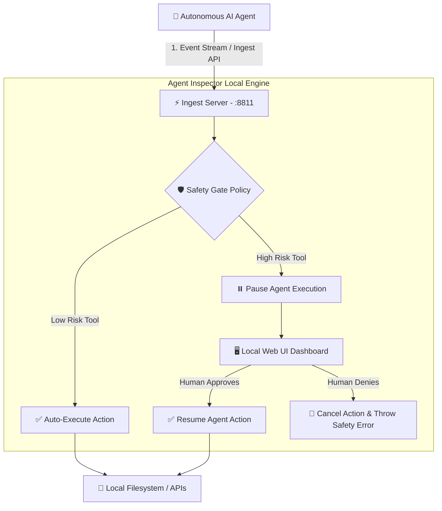

<div align="center">

  <h1>🛡️ Agent Action Inspector</h1>
  <p><strong>Inspect what your AI agent did, replay execution trajectories, & Approve / Deny risky actions before execution</strong></p>

  <p>
    <a href="https://github.com/kashifdevfe/agentinspector/stargazers">
      
    </a>
    <a href="https://github.com/kashifdevfe/agentinspector/blob/main/LICENSE">
      
    </a>
    
    
    
    
  </p>

  <a href="#-quickstart">🚀 Quickstart</a> •
  <a href="#-features">✨ Features</a> •
  <a href="#-architecture">🏗️ Architecture</a> •
  <a href="#-adapters">🔌 Adapters</a> •
  <a href="#-roadmap">🗺️ Roadmap</a>

</div>

<br/>

---

## 📌 Overview

**Agent Action Inspector** is a local-first observability and human-in-the-loop governance tool for AI coding agents and autonomous workflows. It provides real-time trajectory inspection, tool execution replays, and live **Approve / Deny** safety gates.

> 🔒 **100% Local & Private**: Runs entirely on your local machine with zero external cloud dependencies, accounts, or telemetry databases.

---

## ✨ Features

- 📜 **Trajectory Timeline**: Real-time visualization of LLM reasoning, tool calls, and input/output payloads.
- 🛑 **Live Approval Gate**: Pause high-risk tools (e.g. sending emails, deleting files, database writes) until approved by a human.
- 🔁 **Offline Replay**: Load and analyze past agent run logs from JSON files.
- 🔌 **Universal Framework Adapters**: Native support for LangGraph/LangChain, OpenAI Agents, Vercel AI SDK, and generic event schemas.
- ⚛️ **Embeddable Component**: Drop `<AgentInspector />` directly into any React application.

---

## 🏗️ Architecture



---

## 🚀 Quickstart

### 1. One-Time Setup

```powershell
# Clone the repository
git clone https://github.com/kashifdevfe/agentinspector.git
cd agentinspector

# Install dependencies and build packages
pnpm install
pnpm --filter @kashifmuhammad/agent-inspector-core build
pnpm --filter @kashifmuhammad/agent-inspector-react build
```

### 2. Run Demo Agent

```powershell
node examples/real-agent/run.mjs --scripted
```

### 3. Open Inspector Dashboard

```powershell
pnpm --filter @kashifmuhammad/agent-inspector start -- --log examples/runs/support-desk-last.json --port 8811
```

Open **`http://127.0.0.1:8811`** in your browser to view the trajectory timeline!

---

## 🎛️ Live Approve / Deny (Human-in-the-Loop)

### Terminal A - Start Inspector Server
```powershell
pnpm --filter @kashifmuhammad/agent-inspector start -- --live --port 8811
```

### Terminal B - Run Agent in Live Mode
```powershell
$env:INSPECTOR_URL="http://127.0.0.1:8811"
node examples/real-agent/run.mjs --scripted --live
```

When a risky action triggers (`create_portal_link`, `send_email`, `update_ticket_status`):
- Click **Approve** in the browser -> Agent completes execution.
- Click **Deny** in the browser -> Agent cancels the action safely.

---

## 🔌 Supported Adapters

| Adapter | Flag | Input Format / Compatibility |
| :--- | :--- | :--- |
| **Auto-Detect** | `--adapter auto` | Automatically detects JSON structure |
| **Generic** | `--adapter generic` | `{ "version": 1, "events": [...] }` |
| **LangGraph / LangChain** | `--adapter langgraph` | `{ "messages": [{ "type": "human\|ai\|tool" }] }` |
| **OpenAI Agents / Chat** | `--adapter openai` | OpenAI Chat Completions & Assistants API |
| **Vercel AI SDK** | `--adapter vercel-ai` | `{ "messages": [...] }` or `{ "steps": [...] }` |

---

## 💻 Embed in React App

```bash
pnpm add @kashifmuhammad/agent-inspector-react @kashifmuhammad/agent-inspector-core
```

```tsx
import { AgentInspector } from "@kashifmuhammad/agent-inspector-react";
import "@kashifmuhammad/agent-inspector-react/styles.css";

export function Dashboard({ runLog }) {
  return <AgentInspector log={runLog} mode="replay" />;
}
```

---

## 📁 Repository Layout

```
packages/core         Event schemas & LangGraph adapters
packages/react        <AgentInspector /> UI Component
packages/cli          Local dashboard CLI (agent-inspector)
examples/real-agent   Support-desk agent reference implementation
examples/runs         Sample execution trajectory files
```

---

## 🗺️ Roadmap

- [x] v1.0 Initial release with LangGraph, OpenAI, Vercel AI SDK adapters
- [x] Live human approval gating API
- [ ] v1.1 Rule preset engine & expanded Python agent adapters
- [ ] v1.2 Run comparison view & approval metadata logs

---

## 🤝 Contributing

Contributions are welcome! Check out [`CONTRIBUTING.md`](CONTRIBUTING.md) and [`CODE_OF_CONDUCT.md`](CODE_OF_CONDUCT.md).

---

## 📄 License

Distributed under the MIT License. See `LICENSE` for details.

<div align="center">
  Created with ❤️ by <a href="https://github.com/kashifdevfe"><strong>Kashif Muhammad</strong></a>
</div>
